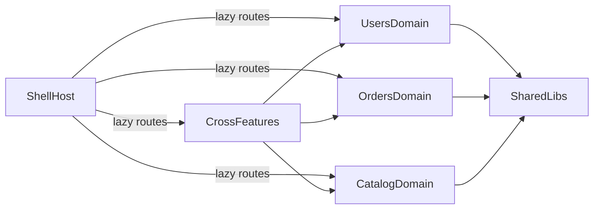

# Estrutura do Projeto (Nx Modular Monolith)

## 1. Visão executiva

Este repositório usa **Nx + Angular** no formato **monorepo modular**.

- O app `shell` é o **host** (ponto de entrada e roteamento).
- As regras de negócio ficam nas `libs` por domínio (`orders`, `users`, `catalog`).
- Existem features transversais em `libs/features` para jornadas que combinam mais de um domínio.
- Bibliotecas compartilhadas (`libs/shared`) concentram utilitários e infraestrutura comum.

Objetivo arquitetural: separar responsabilidades por domínio sem perder velocidade de desenvolvimento em um único workspace.

---

## 2. Stack técnica

- **Frontend:** Angular `~21.2`
- **Monorepo/build:** Nx `22.6.1`
- **Estado:** `@ngrx/signals` e `@ngrx/store`
- **Linguagem:** TypeScript `~5.9`
- **Estilo:** SCSS + TailwindCSS `^3.4`
- **Unit test:** Vitest (`@angular/build:unit-test`, `@nx/angular:unit-test`)
- **E2E:** Playwright (`shell-e2e`)
- **Lint/format:** ESLint + Prettier

Fontes: `package.json`, `nx.json`, `shell/project.json`.

---

## 3. Estrutura de pastas e projetos Nx

### Raiz do workspace

- `shell/`: aplicação Angular principal
- `shell-e2e/`: projeto E2E
- `libs/`: bibliotecas de domínio, transversais e compartilhadas
- `nx.json`: convenções de targets, cache e plugins Nx
- `tsconfig.base.json`: aliases `@my-workspace/*`

### Projetos por domínio

### Orders (`domain:orders`)

- `orders-data-access`
- `orders-ui-components`
- `orders-util-validators`
- `orders-feature-order-list`
- `orders-feature-checkout`

### Users (`domain:users`)

- `users-data-access`
- `users-ui-components`
- `users-util-validators`
- `users-feature-auth`
- `users-feature-profile`

### Catalog (`domain:catalog`)

- `catalog-data-access`
- `catalog-ui-components`
- `catalog-util-validators`
- `catalog-feature-browse`
- `catalog-feature-detail`

### Shared (`domain:shared`)

- `shared-ui`
- `shared-store`
- `shared-i18n`
- `shared-interfaces`
- `shared-util-http`
- `shared-util-auth`

### Cross-domain (`domain:cross`)

- `features-dashboard`
- `features-checkout-flow`
- `features-user-onboarding`
- `shell` (`type:infra`, `npm:public`)
- `shell-e2e` (`type:infra`)

### Convenção de tipos (tags)

- `type:data-access`: acesso a dados/serviços/store
- `type:ui`: componentes visuais
- `type:util`: validações e utilitários
- `type:feature`: páginas/fluxos funcionais
- `type:infra`: host e infraestrutura

---

## 4. Arquitetura (host + domínios + features transversais)

O `shell` concentra o roteamento e carrega as features via **lazy loading**.

- Rotas em `shell/src/app/app.routes.ts`
- Providers globais em `shell/src/app/app.config.ts`
- Home de navegação em `shell/src/app/home.html`

### Diagrama de alto nível

### Como o shell conecta tudo

- `/orders/list` -> `@my-workspace/orders/features/feature-order-list`
- `/orders/checkout` -> `@my-workspace/orders/features/feature-checkout`
- `/users/auth` -> `@my-workspace/users/features/feature-auth`
- `/users/profile` -> `@my-workspace/users/features/feature-profile`
- `/catalog/browse` -> `@my-workspace/catalog/features/feature-browse`
- `/catalog/detail` -> `@my-workspace/catalog/features/feature-detail`
- `/dashboard` -> `@my-workspace/features/dashboard`
- `/checkout-flow` -> `@my-workspace/features/checkout-flow`
- `/onboarding` -> `@my-workspace/features/user-onboarding`

---

## 5. Fluxos principais de ponta a ponta

### Orders

- `OrderList` injeta `OrdersService` e chama `load()` ao iniciar.
- `Checkout` usa validador (`isValidOrderTotal`) e chama `create()` para pedido demo.
- `OrdersService` usa cache TTL (`30s`) e invalida cache em mutação.
- `OrdersApi` hoje usa dados em memória (`const ORDERS`), sem backend real.

Arquivos:
- `libs/orders/features/feature-order-list/src/lib/order-list.ts`
- `libs/orders/features/feature-checkout/src/lib/checkout.ts`
- `libs/orders/data-access/src/lib/orders.service.ts`
- `libs/orders/data-access/src/lib/orders.store.ts`
- `libs/orders/data-access/src/lib/orders.api.ts`

### Users/Auth

- `Login` valida email/senha (`users/util-validators`) e chama `AuthService.login(email)`.
- `AuthService` preenche usuário em store local (mock).

Arquivos:
- `libs/users/features/feature-auth/src/lib/login.ts`
- `libs/users/data-access/src/lib/auth.service.ts`

### Catalog

- `CatalogService` busca de `CatalogApi` e publica no `CatalogStore`.

Arquivo:
- `libs/catalog/data-access/src/lib/catalog.service.ts`

### Features transversais

- `DashboardPage`: combina `orders + users + catalog`.
- `CheckoutPage` (`checkout-flow`): combina `orders + catalog`.
- `OnboardingPage`: combina `users + catalog`.

Arquivos:
- `libs/features/dashboard/src/lib/dashboard-page.ts`
- `libs/features/checkout-flow/src/lib/checkout-page.ts`
- `libs/features/user-onboarding/src/lib/onboarding-page.ts`

---

## 6. Como rodar e validar localmente

No root do workspace (`my-workspace`):

- Subir app host:
  - `npx nx serve shell`
- Rodar testes unitários do shell:
  - `npx nx test shell`
- Rodar lint do shell:
  - `npx nx lint shell`
- Rodar E2E:
  - `npx nx e2e shell-e2e`

Dica: para inspecionar targets de um projeto específico:

- `npx nx show project shell --web`
- `npx nx show project orders-data-access --web`

---

## 7. FAQ da reunião (script pronto)

### Script curto (abertura - 40s)

"A arquitetura é um monorepo Nx com Angular, onde o `shell` funciona como host de rotas e composição. Cada domínio (`orders`, `users`, `catalog`) está isolado em libs com camadas de `data-access`, `ui`, `util` e `feature`. Temos também features cross-domain (`dashboard`, `checkout-flow`, `onboarding`) para jornadas que atravessam domínios. Isso permite evolução modular, reuso e fronteiras claras dentro de um único repositório."

### Perguntas prováveis + resposta sugerida

- **Qual é o papel do `shell`?**  
  "É o app host. Ele não concentra regra de negócio; ele registra providers globais e mapeia rotas lazy para as libs de feature."

- **Onde está a lógica de negócio?**  
  "Principalmente em `libs/*/data-access` e nas features de cada domínio. UI e validações ficam separadas em `ui-components` e `util-validators`."

- **Como vocês evitam acoplamento?**  
  "Com separação por domínio e tipos de lib (`data-access`, `ui`, `util`, `feature`) mais importação por aliases (`@my-workspace/*`) definidos no `tsconfig.base.json`."

- **`/orders/checkout` e `/checkout-flow` são a mesma coisa?**  
  "Não. `/orders/checkout` é feature do domínio orders. `/checkout-flow` é uma feature transversal que compõe dados de múltiplos domínios."

- **Isso já integra com backend real?**  
  "Parcialmente mockado. Exemplo: `OrdersApi` usa dados em memória; então hoje é POC funcional de arquitetura e fluxo."

- **Como está o estado da aplicação?**  
  "Usamos services por domínio com stores baseadas em signals. Em orders, há cache TTL e invalidação no create."

- **Como escalar essa base para produção?**  
  "Trocar APIs mock por HTTP real no `data-access`, manter contratos em `shared/interfaces`, e reforçar regras de dependência entre domínios conforme o produto cresce."

---

## 8. Limitações atuais e próximos passos

### Limitações atuais

- `OrdersApi` é in-memory (não persistente).
- `AuthService` faz login mock (sem autenticação real).
- Algumas features cross-domain ainda são demonstrações de composição.

### Próximos passos recomendados

- Integrar `data-access` com APIs reais (HTTP + tratamento de erro).
- Externalizar configuração por ambiente.
- Definir regras de dependência Nx mais estritas por domínio.
- Expandir suíte E2E cobrindo fluxos críticos.
- Adicionar observabilidade (logs/telemetria) por fluxo.

---

## 9. Referências rápidas de código

- Arquitetura/roteamento:
  - `shell/src/app/app.routes.ts`
  - `shell/src/app/app.config.ts`
  - `shell/src/app/home.html`
- Configuração workspace:
  - `nx.json`
  - `tsconfig.base.json`
  - `package.json`
  - `shell/project.json`
- Fluxos principais:
  - `libs/orders/features/feature-order-list/src/lib/order-list.ts`
  - `libs/orders/features/feature-checkout/src/lib/checkout.ts`
  - `libs/users/features/feature-auth/src/lib/login.ts`
  - `libs/features/dashboard/src/lib/dashboard-page.ts`
  - `libs/features/checkout-flow/src/lib/checkout-page.ts`
  - `libs/features/user-onboarding/src/lib/onboarding-page.ts`
  - `libs/orders/data-access/src/lib/orders.api.ts`
