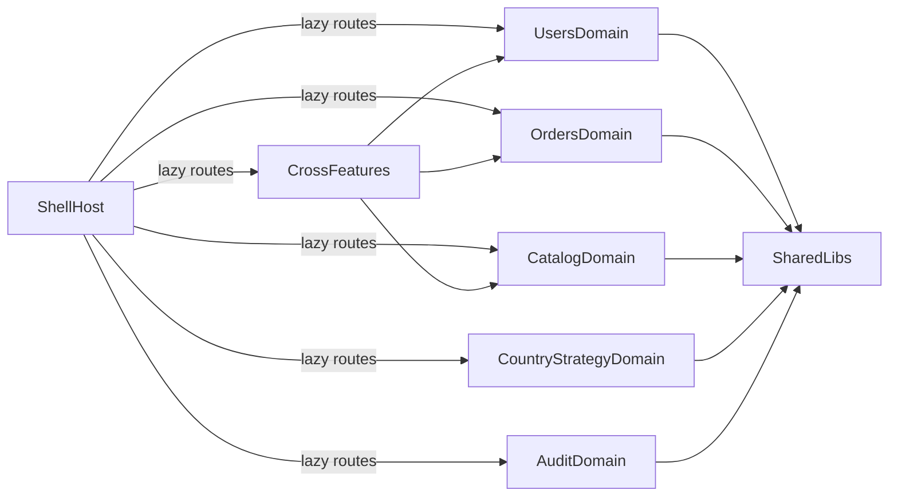
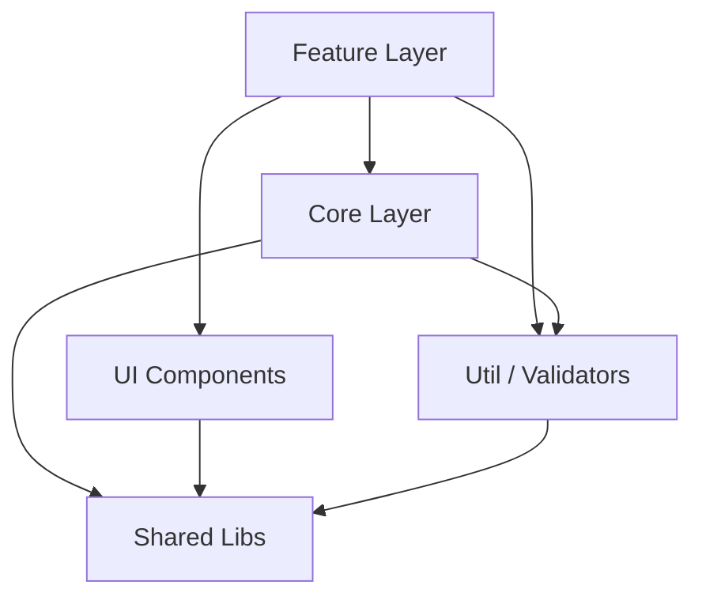
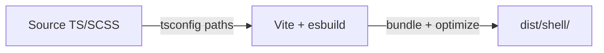

# Estrutura do Projeto (Nx Modular Monolith)

## 1. Visao executiva

Este repositorio usa **Nx + Angular** no formato **monorepo modular**.

- O app `shell` e o **host** (ponto de entrada e roteamento).
- As regras de negocio ficam nas `libs` por dominio (`orders`, `users`, `catalog`, `country-strategy`, `audit`).
- Existem features transversais em `libs/features` para jornadas que combinam mais de um dominio.
- Bibliotecas compartilhadas (`libs/shared`) concentram utilitarios e infraestrutura comum.

Objetivo arquitetural: separar responsabilidades por dominio sem perder velocidade de desenvolvimento em um unico workspace.

---

## 2. Stack tecnica (Vite-first)

- **Frontend:** Angular `~21.2`
- **Monorepo/build:** Nx `22.6.1`
- **Build pipeline:** **Vite** (via `@angular/build:application`) — esbuild para bundling, Vite para dev server
- **Estado:** `@ngrx/signals` e `@ngrx/store`
- **Linguagem:** TypeScript `~5.9` (`target: es2022`, `moduleResolution: bundler`)
- **Estilo:** SCSS + TailwindCSS `^3.4`
- **Unit test:** **Vitest** (`@angular/build:unit-test` / `@nx/angular:unit-test`) via `vitest ^4.0`
- **E2E:** Playwright (`shell-e2e`)
- **Lint/format:** ESLint + Prettier

### Por que "Vite-first"?

No stack Angular 21 + Nx 22, o pipeline `@angular/build` ja usa **Vite internamente** para dev server e testes, e **esbuild** para producao. Nao e necessario configurar `@nx/vite` para apps Angular — o executor `@angular/build:application` encapsula tudo.

| Contexto               | Executor                        | Engine interno |
|------------------------|---------------------------------|----------------|
| Build de producao      | `@angular/build:application`    | esbuild        |
| Dev server             | `@angular/build:dev-server`     | Vite           |
| Testes unitarios (app) | `@angular/build:unit-test`      | Vitest          |
| Testes unitarios (lib) | `@nx/angular:unit-test`         | Vitest          |
| Build de lib           | `@nx/angular:ng-packagr-lite`   | ng-packagr     |

**Decisao tecnica:** o shell nao depende de pre-build das libs (`dependsOn` removido). O pipeline Vite/esbuild compila tudo a partir do source via aliases do `tsconfig.base.json`.

Fontes: `package.json`, `nx.json`, `shell/project.json`.

---

## 3. Estrutura de pastas e projetos Nx

### Raiz do workspace

- `shell/`: aplicacao Angular principal
- `shell-e2e/`: projeto E2E
- `libs/`: bibliotecas de dominio, transversais e compartilhadas
- `nx.json`: convencoes de targets, cache e plugins Nx
- `tsconfig.base.json`: aliases `@my-workspace/*`

### Projetos Nx

#### Dominios (`domain:*`)

| Projeto             | Tags                                 | Responsabilidade                                    |
|---------------------|--------------------------------------|-----------------------------------------------------|
| `orders`            | `domain:orders`, `type:domain`       | Gerenciamento de pedidos (lista, checkout)           |
| `users`             | `domain:users`, `type:domain`        | Autenticacao e perfil de usuario                     |
| `catalog`           | `domain:catalog`, `type:domain`      | Catalogo de produtos (browse, detalhe)               |
| `country-strategy`  | `domain:country-strategy`, `type:domain` | Estrategias por pais (lista, detalhe)             |
| `audit`             | `domain:audit`, `type:domain`        | Trail de auditoria por entidade                      |

#### Shared (`domain:shared`)

| Projeto             | Tags                                 | Responsabilidade                                    |
|---------------------|--------------------------------------|-----------------------------------------------------|
| `shared-ui`         | `domain:shared`, `type:ui`           | Componentes visuais reutilizaveis                    |
| `shared-store`      | `domain:shared`, `type:infra`        | Infraestrutura de state management                   |
| `shared-i18n`       | `domain:shared`, `type:util`         | Internacionalizacao                                  |
| `shared-interfaces` | `domain:shared`, `type:util`         | Contratos e tipos compartilhados                     |
| `shared-util-auth`  | `domain:shared`, `type:util`         | Utilitarios de autenticacao                          |
| `shared-util-http`  | `domain:shared`, `type:util`         | Utilitarios HTTP                                     |

#### Cross-domain (`domain:cross`)

| Projeto                    | Tags                          | Responsabilidade                                |
|----------------------------|-------------------------------|-------------------------------------------------|
| `features-dashboard`       | `domain:cross`, `type:feature`| Dashboard combinando orders + users + catalog   |
| `features-checkout-flow`   | `domain:cross`, `type:feature`| Checkout transversal (orders + catalog)          |
| `features-user-onboarding` | `domain:cross`, `type:feature`| Onboarding (users + catalog)                     |

#### Infraestrutura

| Projeto    | Tags                                     | Responsabilidade                        |
|------------|------------------------------------------|-----------------------------------------|
| `shell`    | `npm:public`, `domain:cross`, `type:infra` | Host, roteamento, providers globais   |
| `shell-e2e`| `type:infra`                             | Testes end-to-end com Playwright        |

### Estrutura interna de cada dominio

Cada dominio segue a mesma organizacao de pastas:

```
libs/<domain>/
  project.json          # Projeto Nx (unico por dominio)
  tsconfig.json         # Configuracao TS do dominio
  tsconfig.spec.json    # Config de teste (vitest/globals)
  src/
    index.ts            # Barrel principal do dominio
  core/
    src/
      index.ts          # Barrel da camada core
      lib/
        <domain>.api.ts        # Acesso a dados (mock/HTTP)
        <domain>.models.ts     # Modelos de dominio
        <domain>.service.ts    # Orquestrador de logica de negocio
        <domain>.store.ts      # Estado reativo (@ngrx/signals)
  features/
    feature-<name>/
      src/
        index.ts               # Barrel da feature
        lib/
          <feature>.ts         # Componente standalone Angular
          <feature>.html       # Template
          <feature>.scss       # Estilos
          <feature>.spec.ts    # Teste unitario (Vitest)
  ui-components/               # (quando aplicavel)
    src/
      index.ts
      lib/
        <component>.ts
        <component>.html
  util-validators/             # (quando aplicavel)
    src/
      index.ts
      lib/
        <domain>-validators.ts
```

### Convencao oficial

- **Um `project.json` por dominio** (no nivel `libs/<domain>/`).
- Subpastas internas (`core`, `features`, `ui-components`, `util-validators`) sao **organizacao de codigo**, nao projetos Nx separados.
- Isso elimina duplicacao de `project.json`, `tsconfig`, `ng-package` em subpastas.
- Promover subpasta a projeto Nx dedicado **somente quando** houver necessidade real de ciclo independente de build/test/lint.

### Convencao de tipos (tags)

- `type:core`: acesso a dados / servicos / store
- `type:ui`: componentes visuais
- `type:util`: validacoes e utilitarios
- `type:feature`: paginas / fluxos funcionais
- `type:infra`: host e infraestrutura
- `type:domain`: marcador de dominio (contém core + features + ui + util)

### Convencao de aliases de importacao

- `@my-workspace/<domain>/core` -> camada core do dominio
- `@my-workspace/<domain>/features/<name>` -> feature especifica
- `@my-workspace/<domain>/ui/<component>` -> componente visual
- `@my-workspace/<domain>/utils` -> utilitarios/validadores
- `@my-workspace/shared/*` -> bibliotecas compartilhadas
- `@my-workspace/features/*` -> features transversais

---

## 4. Arquitetura (host + dominios + features transversais)

O `shell` concentra o roteamento e carrega as features via **lazy loading**.

- Rotas em `shell/src/app/app.routes.ts`
- Providers globais em `shell/src/app/app.config.ts`
- Home de navegacao em `shell/src/app/home.html`

### Diagrama de alto nivel



### Diagrama de camadas internas de um dominio



### Mapeamento de rotas do shell

| Rota                               | Alias de importacao                                     | Componente              |
|------------------------------------|---------------------------------------------------------|-------------------------|
| `/`                                | `./home`                                                | `Home`                  |
| `/orders/list`                     | `@my-workspace/orders/features/order-list`              | `OrderList`             |
| `/orders/checkout`                 | `@my-workspace/orders/features/checkout`                | `Checkout`              |
| `/users/auth`                      | `@my-workspace/users/features/auth`                     | `Login`                 |
| `/users/profile`                   | `@my-workspace/users/features/profile`                  | `Profile`               |
| `/catalog/browse`                  | `@my-workspace/catalog/features/browse`                 | `Browse`                |
| `/catalog/detail/:id`              | `@my-workspace/catalog/features/detail`                 | `Detail`                |
| `/country-strategy/list`           | `@my-workspace/country-strategy/features/list`          | `CountryStrategyList`   |
| `/country-strategy/detail/:id`     | `@my-workspace/country-strategy/features/detail`        | `CountryStrategyDetail` |
| `/dashboard`                       | `@my-workspace/features/dashboard`                      | `DashboardPage`         |
| `/checkout-flow`                   | `@my-workspace/features/checkout-flow`                  | `CheckoutPage`          |
| `/onboarding`                      | `@my-workspace/features/user-onboarding`                | `OnboardingPage`        |
| `/audit/:entityType/:entityId`     | `@my-workspace/audit/features/audit-page`               | `AuditPage`             |

---

## 5. Regras de dependencia (Nx Module Boundaries)

As boundaries sao enforced via `@nx/enforce-module-boundaries` no `eslint.config.mjs`.

### Isolamento por dominio

Cada dominio so pode importar de si mesmo e de `domain:shared`:

```
domain:orders         -> domain:orders, domain:shared
domain:users          -> domain:users, domain:shared
domain:catalog        -> domain:catalog, domain:shared
domain:country-strategy -> domain:country-strategy, domain:shared
domain:audit          -> domain:audit, domain:shared
domain:shared         -> domain:shared
domain:cross          -> todos os dominios + domain:shared
```

### Isolamento por tipo de lib

```
type:feature -> type:feature, type:core, type:domain, type:ui, type:util, domínios, domain:shared
type:core    -> type:core, type:util, domain:shared
type:ui      -> type:core, type:ui, type:util, domain:shared
type:util    -> type:util, domain:shared
type:infra   -> todos os tipos e domínios (shell precisa de acesso total)
npm:public   -> * (sem restrição)
```

### Beneficio pratico

Se um desenvolvedor tentar importar `@my-workspace/users/core` dentro de `libs/orders/`, o lint **bloqueia** automaticamente. Isso previne acoplamento entre dominios sem depender de revisao manual.

---

## 6. Fluxos principais de ponta a ponta

### Orders

- `OrderList` injeta `OrdersService` via `@my-workspace/orders/core` e chama `load()` ao iniciar.
- `Checkout` usa validador (`isValidOrderTotal`) e chama `create()` para pedido demo.
- `OrdersService` usa cache TTL (`30s`) e invalida cache em mutacao.
- `OrdersApi` hoje usa dados em memoria (`const ORDERS`), sem backend real.

### Users/Auth

- `Login` valida email/senha (`users/util-validators`) e chama `AuthService.login(email)` via `@my-workspace/users/core`.
- `AuthService` preenche usuario em store local (mock).

### Catalog

- `CatalogService` busca de `CatalogApi` e publica no `CatalogStore` (consumo via `@my-workspace/catalog/core`).

### Country Strategy

- `CountryStrategyList` carrega lista de estrategias via `CountryStrategyService` e exibe com links para detalhe.
- `CountryStrategyDetail` carrega estrategia por ID e oferece link para trail de auditoria.
- `CountryStrategyApi` usa dados em memoria (2 registros demo: Brazil Growth, Chile Expansion).
- `CountryStrategyStore` segue mesmo padrao de cache TTL do `OrdersStore`.

### Audit

- `AuditPage` recebe `entityType` e `entityId` via rota e carrega trail de auditoria.
- Fluxo de concorrencia otimista com `ETag` / `If-Match`.

### Features transversais

- `DashboardPage`: combina `orders + users + catalog`.
- `CheckoutPage` (`checkout-flow`): combina `orders + catalog`.
- `OnboardingPage`: combina `users + catalog`.

---

## 7. Configuracao de testes (Vitest via Vite)

Todos os testes unitarios usam **Vitest** atraves do pipeline Vite integrado ao Angular.

### Como funciona

- Shell usa `@angular/build:unit-test` (Vitest direto via Angular CLI).
- Libs usam `@nx/angular:unit-test` (wrapper Nx que delega ao mesmo Vitest).
- Cada dominio e feature tem `tsconfig.spec.json` com `"types": ["vitest/globals"]`.
- Testes usam `describe`, `it`, `expect`, `beforeEach` como globals do Vitest.
- Componentes Angular sao testados com `TestBed` + `ComponentFixture`.
- **Nao ha Jest, Karma ou Jasmine** — todo o pipeline e Vitest nativo.

### Comandos

```bash
# Testar o shell
npx nx test shell

# Testar um dominio especifico
npx nx test orders
npx nx test country-strategy

# Testar todos os projetos
npx nx run-many -t test

# Testar todos os projetos impactados (CI)
npx nx run-many -t test --projects=shell,orders,users,catalog,country-strategy,audit,features-dashboard,features-checkout-flow,features-user-onboarding
```

---

## 8. Como rodar e validar localmente

No root do workspace (`my-workspace`):

```bash
# Subir app host (Vite dev server)
npx nx serve shell

# Build de producao (esbuild via @angular/build)
npx nx build shell

# Rodar testes unitarios (Vitest)
npx nx test shell
npx nx test orders
npx nx test country-strategy

# Rodar lint
npx nx lint shell
npx nx run-many -t lint --projects=shell,orders,users,catalog,country-strategy,audit,features-dashboard,features-checkout-flow,features-user-onboarding

# Rodar E2E
npx nx e2e shell-e2e

# Build independente de uma lib (ng-packagr)
npx nx build orders

# Gerar grafo de dependencias
npx nx graph --file="static/dep-graph.html"

# Inspecionar targets de um projeto
npx nx show project shell --web
npx nx show project orders --web
npx nx show project country-strategy --web
```

### Troubleshooting

| Sintoma | Causa provavel | Solucao |
|---------|---------------|---------|
| `Cannot find name 'describe'` | `tsconfig.spec.json` sem `vitest/globals` | Adicionar `"types": ["vitest/globals"]` no `compilerOptions` |
| `Cannot discover package sources` | Lib sem `package.json` | Criar `package.json` minimal na raiz da lib |
| `TS6059: File is not under rootDir` | `ng-package.json` `entryFile` dentro de `src/` mas codigo em `core/` | Usar `entryFile: "index.ts"` na raiz da lib |
| Build do shell tenta buildar libs | `dependsOn: ["^build"]` no target default | Pipeline Vite-first nao precisa de pre-build — remover `dependsOn` |

---

## 9. Diferenca em relacao a abordagem anterior

### Antes (abordagem convencional)

- Cada subpasta interna (`core`, `features/feature-*`, `ui-components`, `util-validators`) era um **projeto Nx separado** com seu proprio `project.json`, `tsconfig.json`, `tsconfig.lib.json`, `package.json`.
- Resultava em dezenas de arquivos de configuracao duplicados.
- Dificulta a navegacao e confunde novos desenvolvedores.
- Overhead de manutencao ao atualizar configs em cascata.

### Agora (estrutura final)

- **Um projeto Nx por dominio** com subpastas internas como organizacao de codigo.
- Configuracao centralizada: um unico `project.json`, `tsconfig.json` e `tsconfig.spec.json` por dominio.
- Aliases de importacao (`@my-workspace/<domain>/core`, `@my-workspace/<domain>/features/<name>`) resolvidos no `tsconfig.base.json`.
- Boundaries enforced via tags Nx + ESLint (impede acoplamento entre dominios automaticamente).
- Cada dominio pode ser testado e lintado de forma independente.

### Beneficios

1. **Menos boilerplate**: arquivos de configuracao reduzidos em ~80%.
2. **Fronteiras claras**: regras de dependencia bloqueiam imports invalidos em tempo de lint.
3. **Grafo visual**: `nx graph` mostra como cada dominio se conecta sem ruido de subprojetos.
4. **Escalabilidade**: adicionar um novo dominio segue o mesmo template sem aumentar complexidade.
5. **Independencia**: cada dominio pode evoluir, ser testado e lintado sem afetar outros.
6. **Navegacao simples**: estrutura intuitiva para novos membros da equipe.

---

## 10. FAQ da reuniao (script pronto)

### Script curto (abertura - 40s)

"A arquitetura e um monorepo Nx com Angular, onde o `shell` funciona como host de rotas e composicao. Cada dominio (`orders`, `users`, `catalog`, `country-strategy`, `audit`) esta isolado em libs com camadas de `core`, `ui`, `util` e `feature`. Temos tambem features cross-domain (`dashboard`, `checkout-flow`, `onboarding`) para jornadas que atravessam dominios. Isso permite evolucao modular, reuso e fronteiras claras dentro de um unico repositorio."

### Perguntas provaveis + resposta sugerida

- **Qual e o papel do `shell`?**
  "E o app host. Ele nao concentra regra de negocio; ele registra providers globais e mapeia rotas lazy para as libs de feature."

- **Onde esta a logica de negocio?**
  "Principalmente em `libs/*/core` e nas features de cada dominio. UI e validacoes ficam separadas em `ui-components` e `util-validators`."

- **Como voces evitam acoplamento?**
  "Com separacao por dominio e tipos de lib (`core`, `ui`, `util`, `feature`) mais importacao por aliases (`@my-workspace/*`) definidos no `tsconfig.base.json`. Regras de Nx module boundaries no ESLint bloqueiam imports invalidos automaticamente."

- **`/orders/checkout` e `/checkout-flow` sao a mesma coisa?**
  "Nao. `/orders/checkout` e feature do dominio orders. `/checkout-flow` e uma feature transversal que compoe dados de multiplos dominios."

- **Isso ja integra com backend real?**
  "Parcialmente mockado. Exemplo: `OrdersApi` e `CountryStrategyApi` usam dados em memoria; entao hoje e POC funcional de arquitetura e fluxo."

- **Como esta o estado da aplicacao?**
  "Usamos services por dominio com stores baseadas em signals (@ngrx/signals). Em orders e country-strategy, ha cache TTL e invalidacao."

- **Como escalar essa base para producao?**
  "Trocar APIs mock por HTTP real no `core`, manter contratos em `shared/interfaces`, e reforcar regras de dependencia entre dominios conforme o produto cresce."

- **Por que um projeto Nx por dominio em vez de por subpasta?**
  "Reduz boilerplate, centraliza config e torna o grafo Nx mais limpo. Subpastas internas continuam separando responsabilidades, mas sem overhead de projetos independentes."

---

## 11. Modelo Vite-first — detalhes tecnicos

### Pipeline de build



- O shell compila **diretamente do source** das libs via aliases `@my-workspace/*` definidos em `tsconfig.base.json`.
- Nao ha etapa intermediaria de ng-packagr antes do build do app.
- Libs mantem target `build` com ng-packagr para uso independente (publicacao, validacao de tipos), mas o shell **nao depende** deles em tempo de build.

### Configuracao base TypeScript

`tsconfig.base.json` usa configuracoes modernas compativeis com Vite:

```json
{
  "target": "es2022",
  "module": "esnext",
  "moduleResolution": "bundler",
  "isolatedModules": true
}
```

Projetos individuais herdam e podem sobrescrever via `tsconfig.json` local.

### Target defaults (nx.json)

| Executor | cache | dependsOn | inputs |
|----------|-------|-----------|--------|
| `@angular/build:application` | sim | — | production, ^production |
| `@angular/build:unit-test` | sim | — | default, ^production |
| `@nx/angular:ng-packagr-lite` | sim | ^build | production, ^production |
| `@nx/angular:unit-test` | sim | — | default, ^production |
| `@nx/eslint:lint` | sim | — | default, eslint configs |

---

## 12. Limitacoes atuais e proximos passos

### Limitacoes atuais

- `OrdersApi` e `CountryStrategyApi` sao in-memory (nao persistente).
- `AuthService` faz login mock (sem autenticacao real).
- Algumas features cross-domain ainda sao demonstracoes de composicao.

### Proximos passos recomendados

- Integrar `core` com APIs reais (HTTP + tratamento de erro).
- Externalizar configuracao por ambiente.
- Expandir suite E2E cobrindo fluxos criticos.
- Adicionar observabilidade (logs/telemetria) por fluxo.
- Implementar mais dominios seguindo o template estabelecido.

---

## 13. Evidencias da iteracao final (Vite migration)

### Mudancas entregues nesta iteracao

- **Vite-first pipeline**: `@angular/build:application` (Vite/esbuild) como build principal, sem pre-build de libs.
- **tsconfig.base.json modernizado**: `target: es2022`, `moduleResolution: bundler`, `isolatedModules: true`.
- **nx.json limpo**: `dependsOn: ["^build"]` removido do `@angular/build:application` — Vite compila do source.
- **Domain libs com entry root-level**: `ng-package.json` aponta para `index.ts` na raiz (resolve rootDir para builds independentes).
- **package.json** adicionado a todas as libs que faltavam (domain + cross-features).
- Documentacao atualizada com modelo Vite-first e troubleshooting.

### Mudancas da iteracao anterior (arquitetura)

- Todos os dominios (`orders`, `users`, `catalog`, `country-strategy`, `audit`) com:
  - `project.json` com targets `build`, `test` e `lint`
  - `tsconfig.json` + `tsconfig.spec.json` com `vitest/globals`
- Features transversais (`dashboard`, `checkout-flow`, `user-onboarding`) com mesma config.
- Boundaries completas no `eslint.config.mjs` para todos os dominios e tipos.
- Grafo arquitetural em `static/dep-graph.html`.

### Validacao executada

```bash
npx nx graph --file="static/dep-graph.html"
npx nx run-many -t lint --projects=shell,orders,users,catalog,country-strategy,audit,features-dashboard,features-checkout-flow,features-user-onboarding
npx nx run-many -t test --projects=shell,orders,users,catalog,country-strategy,audit,features-dashboard,features-checkout-flow,features-user-onboarding
npx nx run-many -t build --projects=orders,users,catalog,country-strategy,audit
npx nx build shell
```

---

## 14. Referencias rapidas de codigo

- Arquitetura/roteamento:
  - `shell/src/app/app.routes.ts`
  - `shell/src/app/app.config.ts`
  - `shell/src/app/home.html`
- Configuracao workspace:
  - `nx.json`
  - `tsconfig.base.json`
  - `package.json`
  - `shell/project.json`
- Boundaries:
  - `eslint.config.mjs`
- Fluxos por dominio:
  - `libs/orders/features/feature-order-list/src/lib/order-list.ts`
  - `libs/orders/features/feature-checkout/src/lib/checkout.ts`
  - `libs/orders/core/src/lib/orders.service.ts`
  - `libs/users/features/feature-auth/src/lib/login.ts`
  - `libs/catalog/features/feature-browse/src/lib/browse.ts`
  - `libs/country-strategy/features/feature-list/src/lib/country-strategy-list.ts`
  - `libs/country-strategy/features/feature-detail/src/lib/country-strategy-detail.ts`
  - `libs/country-strategy/core/src/lib/country-strategy.service.ts`
  - `libs/audit/features/feature-audit/src/lib/audit-page.ts`
- Features transversais:
  - `libs/features/dashboard/src/lib/dashboard-page.ts`
  - `libs/features/checkout-flow/src/lib/checkout-page.ts`
  - `libs/features/user-onboarding/src/lib/onboarding-page.ts`
